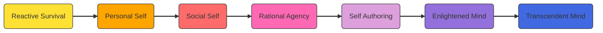
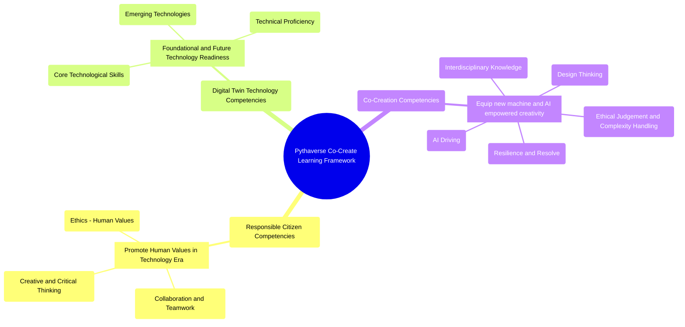
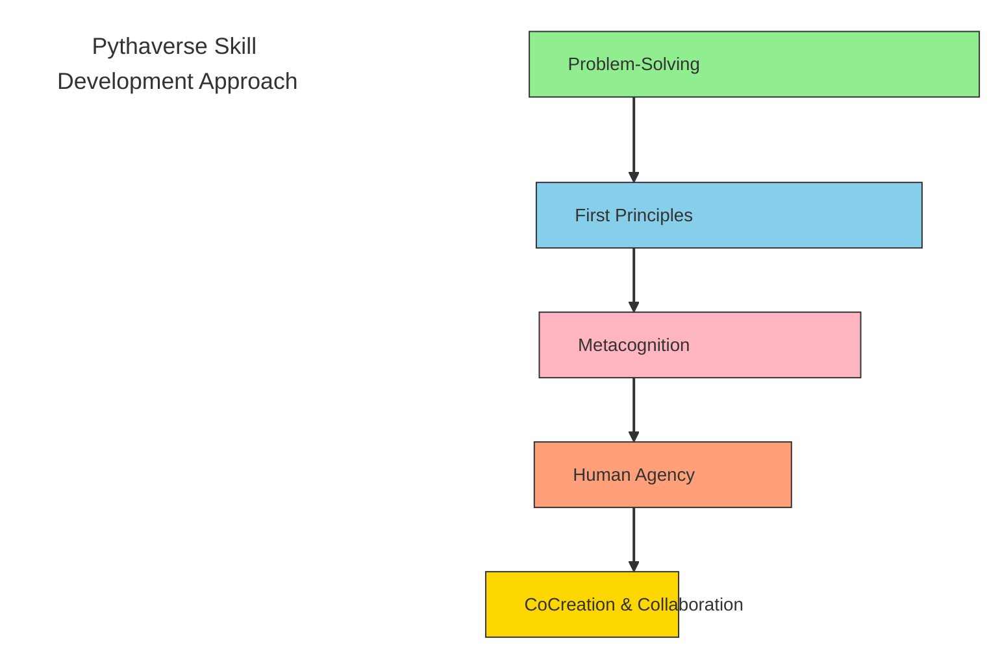
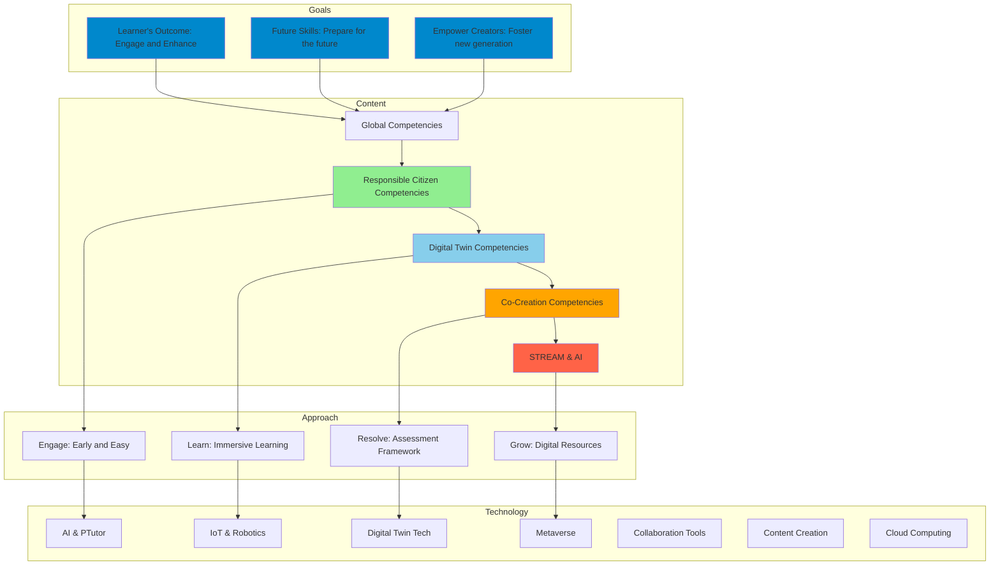
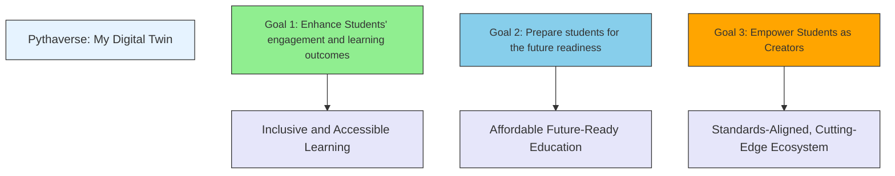

PYTHAVERSE WHITEPAPER	NAVIGATING THE AI ERA

# **PYTHAVERSE**

# **NAVIGATING THE AI ERA**

EXTENSION REPORT OF

PYTHAVERSE CO-CREATE LEARNING FRAMEWORK

PYTHAVERSE WHITEPAPER	NAVIGATING THE AI ERA

# **TABLE OF CONTENTS**

**02**	Executive Summary

**04**	Navigating the AI Era

**14**	The Urgent Need for AI Agent Driving and Digital Twin Competencies

**19**	Get Your School Ready for Education 2.0 with Pythaverse CoCreate Framework

**23**		Pythaverse Co-Creation Learning Framework

**25**	Pythaverse Solutions in Action

**29**	Digital Twin Robotics mastering with Leanbot

**33**	AI Driving and Development Mastering with TwinSpace

**39**	Advices for Students

**41**	Suggestions for Parents

**43**	Suggestions for Educators

**45**	Suggestions for Partners

47. Join us in shaping the Future

48. Acknowledgements

49. Appendices

50. References

51. Authors

## 	Executive Summary

***At Pythaverse, we believe that technology should serve humanity, not replace its core values. As AI and Digital Twin technologies reshape the world, our goal is to ensure that students grow into thinkers, creators, and compassionate leaders. Education must go beyond technical skills; it must cultivate empathy, critical thinking, and the resilience to adapt with purpose.***  
***The CoCreate Framework is our commitment to integrating human values into every aspect of digital learning. By empowering students to wield technology ethically and responsibly, we are building a future where human agency remains at the heart of progress.***  
Trung Nguyen- Founder, CEO, Pythaverse

The Pythaverse CoCreate Framework Whitepaper, initially released in January 2024, introduced a visionary approach to preparing students and educational institutions for the transformative challenges posed by AI, Digital Twin technologies, and the demands of Education 2.0. This updated Whitepaper provides clarity and actionable insights on the critical questions educators, parents, and institutions face as AI reshapes the educational landscape.

### **Need for Pythaverse CoCreate Framework**

With AI disrupting traditional roles and creating new opportunities, there’s an urgent need to equip students with competencies beyond academic knowledge. The CoCreate Framework, developed by Pythaverse, emphasizes a holistic approach, integrating skills in AI, Digital Twin technology, and human-centered values, ensuring students are prepared to thrive in a digital and collaborative world.

### **Key Contents of the Report**

1. **Future Skill Predictions**

  Data highlights a projected surge in demand for AI and Digital Twin expertise, with job growth expected across multiple sectors. By 2030, there will be millions of new roles requiring AI skills, with nearly half of organizations adopting Digital Twin technologies.

  Key metrics include a 74% annual growth in AI roles, upskilling needs for 375 million workers, and a significant increase in global investment in AI- driven educational tools.

2. ### **Stages of Cognitive and Emotional Development**

  Based on Joscha Bach’s stages of lucidity, the report identifies "Rational Agency" as a pivotal stage for students, enabling critical thinking, independent decision-making, and ethical reasoning- skills crucial for navigating AI-integrated environments.

  The framework stresses helping students progress beyond the "Social Self" stage to develop personal agency and resilience, essential for dealing with digital overload and social challenges.

3. ### **CoCreate Learning Framework**

  This framework integrates Responsible Citizen, Digital Twin, and Co- Creation competencies, providing a structured pathway for students to master technology while fostering ethical values and creativity.

  It offers schools a clear pathway to implement technology-driven, hands-on learning that aligns with future workforce demands.

4. ### **Pythaverse Solutions in Action**

  **Leanbot:** Offers digital twin operations and machine simulations, allowing students to engage in system analysis, optimization, and problem-solving.

  **TwinSpace:** Focuses on AI development, enabling students to design, test, and ethically apply AI solutions in digital twin environments, enhancing their understanding of real-world applications and responsible AI practices.

5. ### **Supporting Different Stakeholders**

  **For Parents:** Guidance on fostering a home environment that supports curiosity, critical thinking, and digital literacy, ensuring children are prepared for an AI-driven future.

  **For Educators:** Strategies for incorporating AI and Digital Twin learning, emphasizing ethical considerations and project-based activities that develop adaptive skills.

  **For Students:** Advice on building foundational STEM and AI skills, critical thinking, and hands-on experience with emerging technologies.

  **For Partners:** Opportunities for technology and content providers to collaborate in shaping Education 2.0, providing resources and real-world applications.

6. ### **Implementation and Partnership Network**

  Pythaverse has established an ecosystem of partner schools, content developers, and technology providers, creating a robust support network for educational transformation. This section outlines how schools can leverage these partnerships to integrate the CoCreate Framework seamlessly.

This report reaffirms Pythaverse’s commitment to leading the educational sector through AI disruption. By adopting the CoCreate Framework, schools, parents, and partners can ensure that students not only adapt to but excel in the digital age.

The report provides a roadmap for integrating AI and Digital Twin technologies with an emphasis on ethical, human-centered learning, preparing the next generation for meaningful and impactful roles in an AI-enhanced world.

## 	Navigating the AI Era

Artificial intelligence is seamlessly integrating into every aspect of our lives- transforming industries, redefining jobs, and reshaping society. This is our current reality, bringing both opportunities and challenges that we must address head-on.

DIAGRAM DESCRIPTION: the evolution of AI capabilities across different tasks from 1998 to 2022:

The journey of artificial intelligence surpassing human performance began in the late 1990s with handwriting recognition. This technology saw rapid improvement between 1998 and 2002, jumping from near zero to about 70% of human performance, and then gradually improved until reaching human-level performance around 2010\.

Speech recognition followed a slower but steady path, gradually improving throughout the 2000s before accelerating in the early 2010s and matching human capabilities around 2016\. Image recognition had a later start but showed dramatic improvement once it began developing around 2010, quickly surpassing human performance by 2015\.

Reading comprehension capabilities emerged around 2012 and made remarkably quick progress, exceeding human abilities by 2018\. Language understanding started showing significant progress around 2016 and reached human parity by 2019\.

The most recent advances have been in areas traditionally considered more challenging for AI. Common sense completion began showing measurable progress around 2018, while both grade school math and code generation saw dramatic improvements starting around 2020, with particularly steep progress curves. By 2022, these capabilities were approaching but had not yet fully reached human-level performance.

What's particularly striking is how the development pattern often follows an S-curve: slow initial progress, followed by a period of rapid improvement, and then a leveling off as performance approaches or exceeds human capabilities. This pattern has repeated across different domains, with each new capability seeming to develop faster than those that came before it.

The data suggests that once AI begins to make progress in a particular domain, it often advances rapidly, frequently achieving superhuman performance within just a few years of reaching human parity. This acceleration of capability development appears to be a consistent pattern across diverse cognitive tasks.

*"According to the World Economic Forum, by 2025, machines and algorithms will create 97 million new jobs, but also displace 85 million existing jobs."*

**Lijean-Student**

**Eddie- Student**

**Lijean-Student**

**Q: How will AI affect my future career options? How can I be better than a robot? A**: AI is transforming many industries by automating routine tasks and creating new roles. Careers in AI development, data science, robotics, and AI ethics are growing rapidly. While robots and AI are excellent at processing data and performing repetitive tasks, humans possess unique qualities that set them apart. You can excel beyond robots by developing skills such as creativity, emotional intelligence, critical thinking, and ethical judgment. These human- centric abilities enable you to innovate, connect deeply with others, and make complex decisions.

**Q: I'm interested in robotics and AI ethics. What skills should I focus on to pursue a career in these areas?**

**A**: To pursue robotics and AI, focus on learning programming languages like Python and C++, understanding mathematics (algebra, calculus), studying machine learning basics, and gaining knowledge in electronics and mechanics. Developing problem-solving skills is also important.

**Q: Please suggest what should I do to be ready, do you have some courses to get started?**

**A**: Absolutely\! To get future-ready, start learning programming, explore AI fundamentals, and boost your problem-solving skills. Pythaverse offers the exciting Leanbot STREAM Robotics (SWRP) program, which jump-starts your journey through hands-on, learn-by-doing experiences. Let's begin this adventure together\!

“DIAGRAM DESCRIPTION: The landscape of AI's influence on the workforce is evolving rapidly across multiple dimensions, with significant implications for employment, skills, and wages. According to The Wall Street Journal, AI specialist roles have experienced remarkable growth, with a 74% annual increase over the past four years, highlighting the strong market demand for AI expertise.

Looking at broader labor market trends, Lightcast reports that demand for AI skills has penetrated 16% of labor markets across 15 different sectors, with Singapore and the US leading this transformation. This indicates a growing integration of AI capabilities across diverse industries and job functions.

The impact on work patterns is also substantial. McKinsey & Company projects that up to 30% of current working hours could be automated by 2030, accelerated by the advancement of generative AI technologies. This shift suggests a significant restructuring of how work is performed across various sectors.

The financial implications of AI skills are notable, with PwC reporting that jobs requiring AI specialist skills command up to a 25% wage premium in some markets. This premium reflects the high value placed on AI expertise and the competitive advantage it provides in the job market.

Perhaps most significantly, the World Economic Forum indicates that up to 40% of the workforce may need to reskill due to AI and automation implementation over the next three years. This highlights the urgent need for workforce adaptation and the critical importance of continuous learning in the AI era.

These statistics collectively paint a picture of a workforce undergoing rapid transformation, where AI skills are increasingly valuable, automation is reshaping work patterns, and the need for reskilling is becoming more urgent than ever.”

| Category | Metric | Current Value (2024) | Projected Value (2030) | Source |
| :---- | :---- | :---- | :---- | :---- |
| Job Creation | New Jobs from AI and Automation | 85 million (2020) | 97 million (2025) | World Economic Forum |
| Adoption of Digital Twins | Percentage of Organizations Using Digital Twins | 13% (2020) | 48% (2025) | Gartner |
| Upskilling Needs | Workers Needing to Change Occupations Due to Automation | 250 million (2020) | 375 million (2030) | McKinsey Global Institute |
| AI Job Growth | Growth Rate of AI Specialist Roles | 74% annual (2020) | Continued rapid growth | LinkedIn |
| Digital Divide | Percentage of Students with Access to Digital Tools | 67% (2022) | 90% (2030) | UNESCO |
| Investment in AI and Digital Technologies | Global Venture Capital Investment in EdTech | $16 billion (2020) | Estimated continued annual increase | Global Venture Capital Reports |
| Urban Planning Adoption | Cities Using Digital Twin Technology | 8 cities (2020) | 40+ cities (2025) | Industry Reports |
| Skill Demand Shift | Increase in Demand for AI/Machine Learning Skills | High (2020) | Very High (2030) | Industry Analysis |
| Emerging Job Roles | Number of Emerging AI and Digital Twin Engineers | 1 million (2024) | 3 million (2030) | Industry Projections |

**Mr.Lim-SchoolHead**

**Mrs. An- Parent**

**Q: What does this mean for my school?**

**A**: As an educator, this diagram highlights the urgent need to adapt our curriculum to meet the fast-growing demand for AI skills. With a 74% annual growth in AI roles and up to 40% of the workforce needing reskilling within three years, it's clear that integrating AI education is critical. Preparing students for automation-driven changes, higher-paying AI roles, and adaptability will ensure their future success in a rapidly evolving job market. Prioritizing STEM and AI literacy is no longer optional- it’s essential.

**Q: What does this mean for my kid?**

**A**: As a parent of a K-12 child, this diagram is a wake-up call: the future job market will be driven by AI. With 74% growth in AI roles and 40% of the workforce needing reskilling, it’s crucial to prepare your child now. Encouraging STEM learning and adaptability will set them up for success, higher-paying roles, and resilience in a world where automation is the norm. Equip them today for tomorrow’s opportunities.

## 	Challeges in Modern Education


| Metric | Current Value | Impact/Details | Source |
| :---- | :---- | :---- | :---- |
| AI Specialist Roles Growth | 74% annual growth | Strong demand for AI expertise over the past four years | The Wall Street Journal |
| Demand for AI Skills in Labor Markets | 16% penetration | Rise in demand across 16 labor markets, with Singapore and US leading | Lightcast |
| Automation of Current Hours Worked | 30% potential automation | Projection of work hours that could be automated by 2030, accelerated by generative AI | McKinsey & Company |
| Wage Premium for AI Skills | 25% premium | Jobs requiring AI specialist skills command higher wages in some markets | PwC |
| Workforce Reskilling Needs | Up to 40% of workforce | Significant portion of workforce may need to reskill due to AI and automation implementation over next three years | World Economic Forum |

| Category | Metric | Current Value (2024) | Projected Value (2030) | Source |
| :---- | :---- | :---- | :---- | :---- |
| Job Creation | New Jobs from AI and Automation | 85 million (2020) | 97 million (2025) | World Economic Forum |
| Adoption of Digital Twins | Percentage of Organizations Using Digital Twins | 13% (2020) | 48% (2025) | Gartner |
| Upskilling Needs | Workers Needing to Change Occupations Due to Automation | 250 million (2020) | 375 million (2030) | McKinsey Global Institute |
| AI Job Growth | Growth Rate of AI Specialist Roles | 74% annual (2020) | Continued rapid growth | LinkedIn |
| Digital Divide | Percentage of Students with Access to Digital Tools | 67% (2022) | 90% (2030) | UNESCO |
| Investment in AI and Digital Technologies | Global Venture Capital Investment in EdTech | $16 billion (2020) | Estimated continued annual increase | Global Venture Capital Reports |
| Urban Planning Adoption | Cities Using Digital Twin Technology | 8 cities (2020) | 40+ cities (2025) | Industry Reports |
| Skill Demand Shift | Increase in Demand for AI/Machine Learning Skills | High (2020) | Very High (2030) | Industry Analysis |
| Emerging Job Roles | Number of Emerging AI and Digital Twin Engineers | 1 million (2024) | 3 million (2030) | Industry Projections |

**Mr.Lim-SchoolHead**

**Mrs. An- Parent**

### **Q: What does this mean for my school?**

**A:** Your school can transform these AI challenges into opportunities by modernizing your curriculum with integrated digital literacy and AI education, while actively engaging parents to address their privacy concerns. By partnering with educational content providers and implementing interactive tech-driven learning methods, you'll not only bridge the technological gap but also prepare students for future workforce demands. This comprehensive approach ensures your school stays ahead of the 93% of systems lacking AI guidance while addressing the critical need for student training, currently missing in 82% of schools.

### **Q: What does this mean for my kid?**

**A:** In today's rapidly evolving educational landscape, proactive parental engagement is crucial to ensure children receive a relevant and comprehensive education. Many schools continue to teach outdated technologies, such as fax machines, which do not prepare students for modern IT careers. Over half of parents fear that AI could reduce job availability and hinder their children's creativity. Traditional teaching methods may not resonate with today's tech-savvy students, leading to disengagement. Limited access to modern educational content can restrict your child's exposure to diverse learning materials, potentially hindering their academic growth. By actively collaborating with educators, parents can advocate for curriculum updates, integrate technology into learning, and support their child's academic journey, ensuring they are well-prepared for future challenges.

## 	A Conversation about Education

At a school community event, Mrs. An, a concerned mother, approaches Mr. Lim, her son’s headmaster, as they watch children play nearby.

**Mrs. An:** Mr. Lim, with AI and new technology changing everything, I’m really worried. What should my son be learning to be prepared? I’m not sure if schools can even keep up with what’s coming.

**Mr. Lim:** I understand, An. We want to prepare students, but it’s overwhelming. How do we bring in AI and digital skills when even teachers aren’t fully trained for it?

**Mrs. An:** I feel the same. I wonder if I should be doing more at home, but I don’t know where to start.

**Mr. Lim:** And I wonder if a school like ours can ever keep up, given the resources we have.

They share a pause, both unsure of the answers, silently watching the kids playing and thinking maybe they should just ask ChatGPT.

**Mrs. An- Parent**

**Mr.Lim-SchoolHead**

### **Q: What skills should I focus on teaching my son to prepare him for a future shaped by AI and technology?**

**ChatGPT:** To prepare your son for a technology-driven future, it’s helpful to focus on a combination of digital, cognitive, and social skills:

 Digital Literacy: Introduce basic computer skills and, if he’s interested, beginner-friendly coding platforms. These foundational skills help in understanding the basics of how technology works.

 Problem-Solving and Critical Thinking: Encourage activities that build logical reasoning, such as puzzles, games, or hands-on projects where he can solve challenges.

 Creativity: Creativity is essential for adapting to change and generating new ideas, especially in fields that intersect with technology.

 Emotional Intelligence and Adaptability: Social skills, like empathy, communication, and flexibility, are valuable as AI changes workplace dynamics. They help in collaboration and navigating environments where people work with both humans and AI systems.

 Starting with these areas can help him build a balanced skill set that will remain relevant as technology evolves.

### **Q: How can I start introducing AI and tech skills in our school when we have limited resources and our teachers aren’t fully trained?**

**ChatGPT:** To begin integrating AI and tech skills with limited resources, consider these steps:

 Start with Digital Literacy Basics: Use free or low-cost online resources to introduce students to digital skills, coding, and logical thinking.

 Teacher Training: Identify a few teachers interested in technology and provide them with access to introductory online courses in digital literacy, coding, or AI. There are many free and affordable training options available for teachers.

 Project-Based Learning: Focus on project-based learning, where students work on small tech-related projects or problem-solving activities. Many foundational skills for AI and technology can be learned through practical exercises in coding, logic, and data handling.

 Collaborate with Local Resources: Look for partnerships with local businesses, tech hubs, or other schools that may be open to sharing resources or supporting tech-related initiatives.

 These steps allow for a gradual introduction to technology and AI while working within budget and resource constraints.

**AI Reshapes U.S. Workforce, Reducing Routine Roles and Boosting Efficiency**

AI is transforming the U.S. workforce by automating routine tasks in sectors like warehousing, legal, and healthcare, reducing the need for entry-level roles. Skilled professions are also seeing changes, with AI tools enhancing efficiency in areas such as diagnostics and document processing. This shift is leading companies to downsize in specific departments, like marketing and customer support, as AI can handle much of the workload. Overall, the trend suggests a growing demand for AI-literate workers, while roles requiring repetitive tasks continue to decline.

| Company/Sector | Key Facts | Source |
| :---- | :---- | :---- |
| Amazon | • 300,000 warehouse positions automated • 45% of internal code AI-assisted • 50% faster deployment cycles | Amazon Annual & Tech Reports |
| JPMorgan | • 360,000 hours of legal work automated • 40% of code review automated • 30% reduction in junior legal staff | JPMorgan Technology Reports |
| Microsoft | • 50% faster bug detection • 70% of Office users using AI tools • 40% reduction in documentation time | Microsoft Corporate Reports |
| Google | • 25% of code AI-generated • 55% increase in developer productivity • 30% reduction in testing time | Google AI Research |
| Meta | • 60% of content moderation AI-assisted • 45% of ad copy AI-generated • 35% reduction in marketing staff | Meta Annual Reports |
| IBM | • 40% of customer service automated • 50% reduction in IT support tickets • 30% faster problem resolution | IBM Business Reports |
| Salesforce | • 35% of CRM tasks automated • 45% reduction in data entry needs • 50% faster report generation | Salesforce Analytics |
| Wells Fargo | • 40% of compliance checks automated • 25% reduction in back-office staff • 60% faster document processing | Banking Industry Reports |
| AP News | • 3,700 financial reports automated quarterly • 50% of earnings reports AI-generated • 30% reduction in junior reporting staff | Associated Press Reports |
| Healthcare AI | • 30% of US hospitals using AI for radiology • 40% reduction in diagnostic time • 25% increase in accuracy | American Hospital Association |

**How Japan Embraced a Robotic Future, Today**

| MOMENTUM–BLOOMBERG YOUTUBE

At Komatsu, construction workers are transitioning from on-site physical labor to remote operations. Workers can now operate machinery and plan construction projects from home offices using digital twin technology and drones. As mentioned by Chike-san from Komatsu, this allows workers to "remotely operate machinery at a construction site from your home."

| Company | Key Facts | Source |
| :---- | :---- | :---- |
| Toyota Manufacturing | • 80% automation in welding & painting processes by 2020 • AI quality control reduces defects by 35% | Toyota Corporate Reports |
| Lawson Retail | • 1000+ stores using shelf-stocking robots • AI inventory management reduces waste by 30% | Lawson Annual Report |
| FamilyMart | • 3,000 stores with AI self-checkout • 40% reduction in staffing costs | METI Retail Innovation Report |
| Mizuho Financial Group | • 19,000 positions transitioned to AI systems • 50% of customer queries handled by AI | Mizuho Financial Group Reports |
| FANUC | • 24/7 automated facilities • 90% reduction in human intervention needed | JARA Reports |
| SoftBank Robotics | • 35% of code generated by AI • 45% faster development cycles | SoftBank Tech Reports |
| Recruit Holdings | • 60% of content creation AI-assisted • 40% reduction in marketing staff | Recruitment Industry Analysis |

| Metric | Current Value (2024) | Projected Value (2030) | Source |
| :---- | :---- | :---- | :---- |
| Job Creation: New Jobs from AI and Automation | 85 million (2020) | 97 million (2025) | World Economic Forum |
| Digital Twins: Organizations Using Digital Twins | 13% (2020) | 48% (2025) | Gartner |
| AI Job Growth: Growth Rate of AI Specialist Roles | 74% annual (2020) | Continued rapid growth | LinkedIn |
| Skill Demand Shift: AI/Machine Learning Skills | High (2020) | Very High (2030) | Industry Analysis |
| Emerging Job Roles: AI and Digital Twin Engineers | 1 million (2024) | 3 million (2030) | Industry Projections |

### **YES, AI-related skills and operating Digital Twin machines are projected to be highly popular, and in which shows a high demand for these skills.**

**Growth in AI Job Roles**: There is a rapid growth rate in AI specialist roles, expected to continue. The data indicates:

**Adoption of Digital Twins**: The adoption of Digital Twin technology by organizations is projected to increase from 13% in 2020 to 48% by 2025, indicating a significant rise in usage and the need for expertise.

**Emerging Job Roles**: The number of emerging job roles specifically for AI and Digital Twin engineers is expected to triple from 1 million in 2024 to 3 million by 2030, showing a clear trend toward these skills.

**Skill Demand Shift**: The demand for AI and machine learning skills is projected to be very high by 2030, further highlighting the importance of these competencies in the future workforce.

In summary, both AI skills and Digital Twin operations are set to become essential in the coming years as organizations increasingly adopt these technologies.

**Mr.Lim-SchoolHead**

**Mrs. An- Parent**

### **Q: How can I prepare my students for careers that involve AI and Digital Twin technologies?**

**A:** Start by incorporating foundational skills in coding, data analysis, and critical thinking into your curriculum. Use project-based learning to simulate real-world applications of AI and Digital Twin concepts. Platforms like Pythaverse, which offers hands-on tools and simulations, can make these topics accessible and engaging for students, helping them build relevant skills early on.

### **Q: What are the core skills students need to succeed in AI-related fields?**

**A:** Beyond technical skills in AI and digital systems, students need strong analytical abilities, problem-solving skills, and adaptability. Encouraging them to learn how to evaluate data, work collaboratively, and approach problems creatively will give them a solid foundation to succeed in fields where AI and Digital Twin technologies are prevalent.

### **Q: How can schools without advanced technology resources introduce students to AI and Digital Twins?**

**A:** Focus on building conceptual understanding through case studies, critical discussions, and project-based learning that doesn’t require advanced hardware. Educators can also leverage online tools, simulations, and partnerships with organizations that provide educational access to AI and Digital Twin resources, helping bridge the technology gap.

### **Q: Will learning AI and Digital Twin skills make a significant difference in my child’s career opportunities?**

**A:** Yes, as these technologies are rapidly growing across sectors, having foundational knowledge and skills in AI and Digital Twin operations can open doors to numerous career paths. Industries are increasingly adopting these technologies, and students with these skills will be well-positioned to fill emerging job roles, which are projected to triple in the coming years.

Diagram: 

In today's rapidly evolving technological landscape, we face a critical challenge: a significant gap between current student capabilities and the demands of tomorrow's tech-driven workforce, particularly in AI and digital twin technologies. This gap isn't just a simple divide; it's a deep chasm that requires careful consideration and strategic planning to cross.

The path forward lies in thoughtfully integrating AI and digital twin training into educational curricula. This integration serves as a crucial bridge, carefully engineered to transport students from their current position to future readiness. Just as a suspension bridge relies on strong foundations and carefully tensioned cables, this educational transformation needs robust support structures and well-balanced educational components.

The goal on the other side of this bridge is clear: students who are fully prepared for tech-driven careers. These aren't just technically proficient graduates, but well-rounded professionals ready to navigate and shape the future of technology in the workforce. The endpoint represents more than just job readiness; it symbolizes the successful transformation of students into confident, capable professionals in the AI and digital twin space.

This educational journey, much like a bridge spanning a wide expanse, requires careful engineering and sustained support. It's not enough to simply build the structure; it needs to be maintained, strengthened, and occasionally updated to meet evolving needs. The curriculum must be flexible yet robust, capable of adapting to rapid technological changes while providing stable passage for students crossing from traditional education to future-ready capabilities.

The success of this bridge depends not just on its design, but on how well it connects the practical realities of today's educational landscape with the ambitious goals of tomorrow's technological needs. It's about creating a smooth, supported transition that allows students to move confidently from where they are to where they need to be in the rapidly evolving world of AI and digital twin technologies.

Integrating competencies in Artificial Intelligence (AI) agents and Digital Twin technologies into K-12 education is increasingly essential. This integration has several implications:

1. **Early Exposure to Emerging Technologies:** Introducing AI and Digital Twin concepts at the K-12 level familiarizes students with technologies that are becoming integral across various industries. Early exposure can demystify these concepts and spark interest in technology-related fields.

2. **Development of Critical Skills:** Engaging with AI and Digital Twin technologies fosters critical thinking, problem-solving, and analytical skills. These competencies are valuable not only in technology sectors but also in diverse career paths.

3. **Enhanced Employability:** As industries increasingly adopt AI and Digital Twin technologies, there is a growing demand for professionals skilled in these areas. Providing students with foundational knowledge can enhance their future employability. A report by McKinsey highlights the transformative potential of AI agents in business processes, underscoring the need for a workforce adept in these competencies.

4. **Promotion of Lifelong Learning:** Introducing these technologies encourages a mindset of continuous learning. Students learn to adapt to technological advancements, preparing them for lifelong learning in a rapidly evolving digital landscape.

5. **Bridging the Digital Divide:** Integrating AI and Digital Twin education can help bridge the digital divide by providing all students, regardless of background, with access to knowledge about cutting-edge technologies. This inclusivity is crucial for equitable opportunities in the future job market.

6. **Curriculum Development Challenges:** Educators and policymakers face the challenge of developing curricula that effectively incorporate these technologies. This includes providing adequate training for teachers and ensuring access to necessary resources. The U.S. Department of Education emphasizes the importance of aligning AI models with educational goals and involving educators in the integration process.

7. **Ethical Considerations:** Teaching AI and Digital Twin technologies also involves discussions about ethical implications, such as data privacy, algorithmic bias, and the societal impact of automation. This prepares students to think critically about the responsible use of technology.

In summary, integrating AI agent and Digital Twin competencies into K-12 education prepares students for future technological landscapes, enhances critical skills, and promotes equitable access to emerging technologies. However, it requires careful curriculum development, teacher training, and consideration of ethical implications.

**The need for Education 2.0\!**

| Skill/Competency | Increasing Importance (%) | Type |
| :---- | :---- | :---- |
| Creative thinking | 73.2 | Attitudes |
| Analytical thinking | 71.6 | Attitudes |
| Technological literacy | 67.7 | Skills |
| Curiosity and lifelong learning | 66.8 | Attitudes |
| Resilience, flexibility and agility | 65.8 | Attitudes |
| Systems thinking | 59.9 | Skills |
| AI and big data | 59.5 | Skills |
| Motivation and self-awareness | 58.9 | Attitudes |
| Talent management | 56.4 | Skills |
| Service orientation and customer service | 54.8 | Attitudes |
| Leadership and social influence | 53.1 | Attitudes |
| Empathy and active listening | 52.3 | Attitudes |
| Dependability and attention to detail | 52.0 | Attitudes |
| Resource management and operations | 51.4 | Skills |
| Networks and cybersecurity | 50.3 | Skills |
| Quality control | 49.5 | Skills |
| Design and user experience | 48.4 | Skills |
| Teaching and mentoring | 47.8 | Attitudes |
| Environmental stewardship | 43.2 | Skills |
| Programming | 38.8 | Skills |
|   |  |  |
| Marketing and media | 38.4 | Skills |
| Multi-lingualism | 38.0 | Skills |
| Reading, writing and mathematics | 26.4 | Skills |
| Global citizenship | 23.8 | Attitudes |
| Sensory-processing abilities | 22.6 | Skills |
| Manual dexterity, endurance and precision | 14.9 | Skills |

According to Citi Global Insights, heart skills \- the human-centric capabilities \- dominate the conversation when it comes to essential workplace competencies. Communication stands out as the most frequently mentioned skill, with 64% of interviewees highlighting its importance. This is closely followed by emotional intelligence at 57%, while both literacy and empathy share the third position at 54% each.  
The next tier of frequently mentioned skills focuses on cognitive abilities, with critical thinking being cited by 46% of interviewees. Human-to-human (H2H) collaboration and problem solving both garnered 43% of mentions, while creativity was noted by 39% of respondents.  
Moving down the hierarchy, adaptability and leadership were each mentioned by 32% of interviewees, while dexterity and learning ability both received 25% of mentions. Resilience and perspective-taking shared similar levels of attention at 21% each.  
At the lower end of the mention frequency, we find some interesting skills that, while mentioned less often, remain part of the conversation. Human-to-machine (H2M) collaboration and ethics both received 11% of mentions. Entrepreneurship and self-awareness were each cited by 7% of interviewees, while organizational skills rounded out the list at 4%.  
This distribution of mentions paints a clear picture: while technical and organizational skills have their place, it's the human-centric "heart skills" \- particularly communication, emotional intelligence, and empathy \- that dominate the discourse around essential workplace capabilities.

**Mr.Lim-SchoolHead**

**Q:** What does this mean to Education?

**A:** Welcome to Education 2.0, where heart skills are the new hard skills, and schools must modernize to meet this evolving landscape. The data is clear: communication (64%), emotional intelligence (57%), and empathy (54%) are as essential as technical skills, highlighting the need for a learning environment that blends these heart skills with digital competencies. This isn't just about integrating technology; it’s about using engaging teaching tools and "learning by doing" in STEM subjects to help students experience and internalize both emotional and analytical skills. Schools must embrace immersive, hands-on learning platforms and environments that bring STEM to life through Digital Twin and AI technologies, enabling students to practice adaptability, problem-solving, and empathy in a real-world context. This future-ready approach empowers students to become not only skilled but emotionally aware and socially responsible, equipping them to thrive in an interconnected world.

## 	The urgent importance of Agency

Human consciousness and development appears to follow a progressive journey through seven distinct stages, each representing a deeper level of self-awareness and cognitive sophistication. The journey begins with "Reactive Survival," the most basic state characterized by instinctive responses to immediate needs and threats, symbolized by a simple face expressing raw emotion.

This evolves into the "Personal Self," where individuals begin to develop a sense of individual identity and basic self-awareness, represented by a figure wearing protective eyewear, suggesting a more deliberate interaction with the world. The journey continues to the "Social Self," where consciousness expands to include awareness of others and social relationships, illustrated by an interconnected network symbol.

Moving further along, "Rational Agency" emerges, depicted by a meditative figure, indicating the development of logical thinking and deliberate decision-making capabilities. This leads to "Self Authoring," symbolized by a lotus flower, representing the ability to consciously shape one's identity and narrative.

The path then progresses to the "Enlightened Mind," shown by a book being offered or received, suggesting the capacity for deep learning and wisdom. Finally, the journey reaches its peak with the "Transcendent Mind," represented by a flowering brain symbol, indicating the highest level of consciousness where one achieves a comprehensive understanding of self and reality.

This progression illustrates how human consciousness can evolve from basic survival instincts to increasingly sophisticated levels of self-awareness and understanding, ultimately reaching a state of transcendent comprehension and wisdom.

In the stages of lucidity model¹, these are the stages:

1. **Reactive Survival** (Infant Mind): This initial stage is characterized by innate reflexes and basic learning processes forming the foundation of consciousness and perception.

2. **Personal Self** (Young Child): Here, the development of a personal identity begins, with the mind distinguishing itself from its external environment.

3. **Social Self** (Adolescence, Domesticated Adult): This stage involves developing a social identity, understanding social emotions, and assimilating societal ideas and morality.

4. **Rational Agency** (Epistemological Autonomy, Self-Directed Adult): Individuals gain the ability to think independently, develop their own belief systems, and take responsibility for their emotions and desires.

5. **Self Authoring** (Full Adult, Wisdom): This stage involves a deeper understanding of one's motivations and the formation of a more mature, self authored identity.

6. **Enlightened Mind**: A stage characterized by profound insight into the nature of perception, motivation, and consciousness, often associated with advanced meditation practices.

7. **Transcendent Mind**: This final stage involves surpassing conventional consciousness and exploring more expansive forms of sentience and agency.

In the AI era, adapting Bloom's Taxonomy becomes crucial, particularly when integrated with Joscha Bach's stages of lucidity. This combination within the Pythaverse COCREATE Framework offers a comprehensive framework for cognitive and emotional development, emphasizing the need for higher cognitive and emotional maturity, especially in creative processes:

In the current digital age, students are at risk of getting “stuck” at the **Social Self** stage in their cognitive and emotional development. This stage, typically associated with adolescence, involves identifying with societal norms, understanding social dynamics, and absorbing external ideas.

However, without progressing to **Rational Agency** and **Human Agency** stages, students may lack the capacity for independent thinking, critical analysis, and self- directed values. Achieving **Rational Agency** is particularly critical, as it enables students to make informed judgments, form independent beliefs, and navigate complex global and technological challenges responsibly. The development of Rational Agency and beyond is essential for fostering resilience, ethical reasoning, and adaptability, qualities necessary for active and thoughtful participation in today’s society.

**Mrs. An- Parent**

### **Q: How can I support my child in developing Rational Agency at home?**

**A:** Encourage your child to question information, even from familiar sources. Engage them in conversations about current events or ethical dilemmas, asking them to explain their reasoning. Show interest in their opinions and help them explore different viewpoints, which fosters confidence in independent thinking.

### **Q: How can I prevent my child from becoming overly influenced by social media?**

**A:** Set boundaries on passive social media use, encouraging them to use technology actively, for learning or creative projects. Discuss the information they encounter online and guide them on how to evaluate credibility. Teaching your child to think critically about digital content will help them become more discerning and less influenced by peer pressures or trends.

**Q: What are some activities that promote human and rational agency? A:** Reading, problem-solving activities, and even simple debates at the dinner table can build reasoning skills. Additionally, encourage activities that require planning, such as setting personal goals or managing a small project. These activities teach your child to evaluate choices, consider consequences, and take responsibility for their actions.


The Pythaverse Co-Create learning framework represents a comprehensive approach to developing competencies in the modern technological era, structured in three interconnected layers that build upon each other to create a holistic learning experience.

At the core of this framework lies the concept of Co-Creation Competencies, which focuses on equipping learners with machine and AI-empowered creativity. This central element encompasses five key areas: AI Driving, Design Thinking, Ethical Judgement and Complexity Handling, Interdisciplinary Knowledge, and Resilience and Resolve. These competencies form the foundation for working effectively with AI and emerging technologies while maintaining human agency and creativity.

Surrounding this core is the layer of Digital Twin Technology Competencies, which emphasizes foundational and future technology readiness. This middle layer consists of three essential elements: Core Technological Skills, Emerging Technologies, and Technical Proficiency. These competencies ensure that learners can effectively engage with and adapt to evolving technological landscapes.

The outer layer represents Responsible Citizen Competencies, focusing on promoting human values in the technology era. This encompasses three crucial areas: Collaboration and Teamwork, Creative and Critical Thinking, and Ethics \- Human Values. This outer layer ensures that technological advancement remains grounded in human values and social responsibility.

The circular representation of these competencies suggests their interconnected nature, with each layer building upon and supporting the others. This framework acknowledges that successful navigation of the AI-driven future requires not just technical skills, but also strong human values, ethical considerations, and the ability to co-create with emerging technologies.

The framework's design emphasizes that learning in the AI era isn't just about acquiring technical knowledge, but about developing a balanced set of competencies that enable responsible innovation and human-centered technological advancement.

**Mrs. An- Parent**

### **Q: What does this framework mean for my child’s future?**

**A:** This framework envisions a progressive approach to learning, where students begin with developing a sense of **Responsible Citizenship** at the core. This foundational layer emphasizes values, ethics, and understanding their role in society. Moving outward, the **Digital Twin Technologies** layer equips students with essential digital skills, technical competencies, and familiarity with emerging technologies, making them proficient in navigating a technology-driven world. The outermost layer, **Co-Creation Competencies**, focuses on collaborative skills, creativity, and the ability to innovate with others, preparing students to actively participate in and shape a future defined by shared problem-solving and global collaboration. This structure ensures that your child not only gains core values but also acquires advanced technical and collaborative skills, empowering them to succeed in a rapidly evolving world.

### **Q: How can I support my child within this framework?**

**A:** You can encourage curiosity and critical thinking at home, support learning in multiple areas (e.g., digital literacy, empathy, problem-solving), and promote activities that develop their adaptability and teamwork. Helping your child engage in diverse experiences, like collaborative projects and real-world problem-solving, will also align with the goals of this framework.

**Mr.Lim-SchoolHead**

**Lijean-Student**

**Q: How should teaching strategies change to align with this framework? A:**	Teaching	strategies	should	move		beyond	traditional		lectures. Educators should incorporate project-based learning, interdisciplinary lessons, and opportunities for students to work on real-world challenges. Focusing on activities that encourage collaboration, empathy, and problem-solving	will	ensure	students	progress		through	all	layers effectively.

### **Q: Why is this framework important for me as a student?**

**A:** This framework is important because it prepares you for a world that requires not only academic knowledge but also flexibility, emotional intelligence, and the ability to work well with others. Each layer builds on the previous one, giving you a well-rounded skill set that will be valuable in any career path.

 

## 	Learning Approach


The Pythaverse Skill Development Approach presents a structured pyramid of competencies, building from foundational abilities to advanced collaborative skills. This hierarchical framework illustrates how different skills build upon each other to create a comprehensive development path.

At the foundation lies Problem-Solving, representing the base level skill from which all other capabilities emerge. This fundamental layer emphasizes the importance of developing basic analytical and solution-oriented thinking as the groundwork for more advanced competencies.

Building upon this base, First Principles thinking forms the second layer. This level focuses on understanding core concepts and fundamental truths, enabling learners to break down complex problems into their basic elements and build up solutions from there.

The middle layer introduces Metacognition \- the ability to understand and regulate one's own thinking processes. This self-reflective capability helps learners become more aware of their learning processes and better able to adapt their thinking strategies.

Moving higher in the pyramid, Human Agency represents the ability to act independently and make informed choices. This level emphasizes the importance of maintaining human decision-making capabilities and autonomy in an increasingly automated world.

At the peak of the pyramid sits CoCreation & Collaboration, representing the highest level of skill development. This culminating capability brings together all lower-level skills to enable effective partnership with both human and artificial intelligence systems.

This progressive structure suggests that mastery of each level is necessary to effectively develop the skills above it. The journey from problem-solving to co-creation isn't just about acquiring individual skills, but about building an integrated set of capabilities that enable effective participation in an AI-enhanced future.

The approach emphasizes that while technical and analytical skills form the foundation, the ultimate goal is to develop collaborative and creative abilities that maintain human agency while leveraging technological advancement.

The Pythaverse Skill Development Approach is a structured framework designed to cultivate essential skills for the modern learner. At its foundation lies **Problem- Solving**, encouraging students to tackle real-world challenges through analysis and solution development.

Building on this, **First Principles** thinking empowers learners to break down complex problems into basic truths, fostering deeper understanding and innovation. **Metacognition**—thinking about one's own thinking—enables students to reflect on their learning processes, enhancing self-awareness and adaptability. Moving up the framework, **Human Agency** emphasizes individual empowerment, encouraging students to take ownership of their actions and learning outcomes.

At the peak is **CoCreation & Collaboration**, which prepares students to work effectively with others, leveraging collective intelligence for creative and impactful solutions. Together, these layers form a comprehensive approach to skill development, preparing learners to thrive in collaborative, technology-driven environments.

**Mr.Lim-SchoolHead**

**Q: Why is Problem-Solving placed at the foundation of this approach? A:** Problem-solving is foundational because it is a critical skill for addressing challenges in any field. By starting with problem-solving, students learn to approach issues systematically, making it easier to build more complex skills as they progress through the framework.

### **Q: How does First Principles thinking help students?**

**A:** First Principles thinking encourages students to break down complex ideas and identify core truths, which promotes deeper understanding and innovation. It helps students develop analytical skills and avoid relying solely on assumptions, fostering original thinking.

### **Q: What is the purpose of teaching Metacognition?**

**A:** Metacognition, or “thinking about thinking,” helps students become more aware of their learning strategies and processes. This awareness allows them to self-reflect, adapt their learning methods, and improve their ability to learn independently.

### **Q: What does Human Agency mean in this framework?**

**A:** Human Agency emphasizes empowering students to take control of their learning and actions. It encourages independence, self-efficacy, and the confidence to make decisions, which are crucial skills for personal and professional growth.

### **Q: How does CoCreation & Collaboration benefit students?**

**A:** CoCreation & Collaboration at the top of the framework prepares students to work with others effectively. It teaches them how to combine ideas, leverage diverse perspectives, and create solutions collaboratively, which is essential for success in a connected, team- oriented world.


The Pythaverse Digital Twin and Co-Creation learning framework presents a comprehensive educational approach that integrates multiple layers of learning objectives, content, and technology. This framework is structured around three main goals:

1. Engage and enhance students' learning outcomes

2. Prepare students for the future through skill development

3. Foster the development of a new generation of creators

The content structure is built on four interconnected pillars:

* Global Competencies as the foundation

* Responsible Citizen Competencies focusing on promoting human values in the technology era

* Digital Twin Competencies emphasizing foundational and future technology readiness

* Co-Creation Competencies driving machine and AI creativity

* All of these are supported by STREAM & AI integration

The framework implements a four-step approach:

1. "Engage" \- Making learning accessible and engaging from the start

2. "Learn" \- Utilizing immersive learning and learning-by-doing methodologies

3. "Resolve" \- Implementing new assessment frameworks and global issues-driven tournaments

4. "Grow" \- Opening up digital resources for continuous development

The technology layer supports these objectives through seven key components:

1. Artificial Intelligence (AI) & PTutor for personalized learning

2. Internet of Things (IoT) & Robotics for interactive learning environments

3. Digital Twin Technology for simulations and modeling

4. Metaverse and virtual spaces for experiential learning

5. Collaboration Tools for interactive classrooms

6. Content Creation and Management tools

7. Cloud Computing for scalability and data analysis

This integrated approach ensures that students develop not just technical skills, but also the human values and creative capabilities needed for success in an AI-enhanced future. The framework emphasizes both technological proficiency and responsible citizenship, creating a balanced approach to education in the digital age.

### **Description of the Pythaverse Digital Twin and Co-Creation Learning Framework**

The Pythaverse Digital Twin and Co-Creation Learning Framework aims to develop globally competent, future-ready students with the skills needed to thrive in a technology-driven world. It is structured around three primary goals: enhancing students' learning outcomes, equipping them with future skills, and empowering them to become creators.

The framework integrates **Global Competencies** to promote responsible citizenship, **Digital Twin Competencies** to build foundational technology skills, and **Co-Creation Competencies** that encourage creative use of AI and machines.

The learning approach emphasizes **Engagement** (starting early and simplifying access), **Learning by Doing** (immersive, hands-on experiences), **Resolution of Real-World Issues** (assessment and global issue-based tournaments), and **Growth** (expanding digital resources). Technologies like AI tutors, IoT labs, digital twin simulations, VR spaces, and collaboration tools support this learning environment, fostering interactive, accessible, and community-driven education.

**Mr.Lim-SchoolHead**

### **Q: How does this framework prepare students for the future?**

**A:** This framework focuses on building essential future skills, such as digital literacy, global competency, and creative problem-solving with AI and digital twins. It gives students hands-on experience with advanced technology, which prepares them to navigate and innovate in the technology-driven world.

**Q: What are Digital Twin Competencies, and why are they important? A:** Digital Twin Competencies involve using virtual models of real-world systems to simulate and understand complex concepts. This is important because it helps students develop technical skills, such as modeling and critical analysis, which are highly relevant in industries that rely on digital twin technology for design and testing.

### **Q: How does the framework promote responsible citizenship?**

**A:** By integrating Global Competencies, the framework encourages students to consider human values and ethical implications in the technology era. This approach helps students become responsible citizens who use technology thoughtfully and understand its societal impacts.

### **Q: What is meant by "Co-Creation Competencies"?**

**A:** Co-Creation Competencies refer to the ability to work creatively with AI and digital tools, using them as partners to solve problems and innovate. This competency encourages students to think of AI and technology as collaborative tools for creativity rather than simply functional tools.

**Q: How does the technology used support this learning approach? A:** Technologies like AI tutors, IoT labs, VR environments, and cloud computing provide interactive and accessible ways to learn complex topics. These tools facilitate immersive learning, foster collaboration, and allow students to engage deeply with real-world problems, enhancing their skill development.

## 	Pythaverse Solutions in Action

Pythaverse's "My Digital Twin" initiative presents a comprehensive educational framework built around three fundamental goals, each supported by specific implementation strategies:

Goal 1: Enhance Students' Engagement and Learning Outcomes This primary objective is achieved through inclusive and accessible learning environments. The platform creates immersive, interactive spaces where students of all backgrounds and abilities can engage with educational content effectively. This approach ensures that digital learning is not just available but truly accessible to all learners.

Goal 2: Prepare Students for Future Readiness The second goal focuses on delivering affordable future-ready education. This approach recognizes that tomorrow's workforce will need different skills and competencies. By making these educational opportunities affordable, Pythaverse ensures that future-ready education is not a privilege but a widely available resource for all students.

Goal 3: Empower Students as Creators The final goal transforms students from passive consumers to active creators through a standards-aligned, cutting-edge ecosystem. This environment provides tools and platforms that enable students to create, innovate, and contribute to the digital world while ensuring alignment with educational standards and industry requirements.

Each goal is represented by a target icon in different colors (green, blue, and orange), symbolizing distinct but interconnected objectives. The goals are supported by visual representations of their implementation strategies, showing how theoretical objectives translate into practical learning environments and tools.

The "My Digital Twin" concept serves as the foundation for this framework, suggesting a personalized, digital learning experience that adapts to each student's needs while maintaining high standards of educational quality and technological innovation.

Pythaverse is designed to enhance student engagement, prepare students for future readiness, and empower them as creators through a cutting-edge digital learning ecosystem. The platform achieves these goals with two core components:

1. ### **Leanbot: Digital Twin Machines Operation & Engineering**

Leanbot allows students to create and manipulate digital replicas of real-world machines and systems. Through Leanbot, students learn to analyze data, interpret insights, and experiment with optimization techniques in a simulated environment, developing practical skills in system efficiency.

2. ### **TwinSpace: AI Agent Driving and Development**

TwinSpace enables students to build, program, and manage AI agents. It includes tools for ethical AI considerations and allows for the integration of AI agents with digital twins, facilitating advanced simulations and applications. This experience gives students a hands-on approach to AI development with an emphasis on ethical use and integration capabilities.

Additionally, **Partner Integration** supports distribution and content partners, offering an easy onboarding process for distribution and seamless content integration with technical assistance for content partners.

**Mr.Lim-SchoolHead**

**Mrs. An- Parent**

**Mr. Wisit- Partner**

### **Q: What are the primary goals of the Pythaverse platform?**

**A:** Pythaverse aims to enhance student engagement, prepare students for future readiness, and empower them as creators. The platform provides interactive tools and immersive environments that equip students with practical skills in digital twins and AI.

### **Q: How does Leanbot help students understand digital twins?**

**A:** Leanbot provides a simulation environment where students can create, manipulate, and experiment with digital replicas. This hands-on experience with data analysis and optimization helps students develop a foundational understanding of digital twin technology and system efficiency.

### **Q: What can students learn from TwinSpace’s AI capabilities?**

**A:** Through TwinSpace, students can build and program AI agents, gaining skills in AI development. They also learn about ethical considerations in AI and how to integrate AI agents with digital twins, giving them practical experience in advanced AI applications.

### **Q: How does Pythaverse support partners in education?**

**A:** For distribution partners, Pythaverse offers a streamlined onboarding process, training, and support. For content partners, it provides technical assistance, co-marketing opportunities, and an integration framework, allowing them to deliver specialized content on the platform.
```mermaid
graph LR
    %% Input Systems
    L[Leanbot]
    T[TwinSpace]
    
    %% Technology Layer
    subgraph TL[Technology Layer]
    AI[AI, IoT, Digital Twin, Metaverse Learning by Doing]
    end
    
    %% Platform and Features
    P[Pythaverse Learning Platform]
    IL[Integrated Learning]
    AP[Accessible Platform]
    SS[Scalable and Supportive]
    EE[Ecosystem of Educators]
    
    %% Connections
    L --> TL
    T --> TL
    TL --> P
    P --> IL
    P --> AP
    P --> SS
    P --> EE
    
    %% Styling
    style L fill:#87CEEB,stroke:#333
    style T fill:#90EE90,stroke:#333
    style AI fill:#4169E1,stroke:#333
    style P fill:#808080,stroke:#333
    style IL fill:#696969,stroke:#333
    style AP fill:#FFA500,stroke:#333
    style SS fill:#FF69B4,stroke:#333
    style EE fill:#DDA0DD,stroke:#333
```The Pythaverse Learning Platform represents a sophisticated educational ecosystem that integrates multiple technologies and systems to create a comprehensive learning experience. Here's how the system comes together:

Input Systems:

* Leanbot: A primary interface system that provides the initial point of contact for users

* TwinSpace: A complementary system that works alongside Leanbot to create a complete learning environment

These systems feed into a central Technology Layer that encompasses:

* AI and IoT integration

* Digital Twin capabilities

* Metaverse-based learning environments

* Learning-by-doing methodologies

This technology core then powers the Pythaverse Learning Platform, which delivers four key features:

1. Integrated Learning: A cohesive approach that brings together various learning modalities and resources into a single, unified experience.

2. Accessible Platform: Ensures that learning resources are available to all users, regardless of their technical proficiency or physical limitations.

3. Scalable and Supportive: Built to grow with user needs while maintaining consistent support for learners at all levels.

4. Ecosystem of Educators: Creates a community of teaching professionals who can collaborate, share resources, and support each other.

The platform's architecture is designed to transform traditional educational approaches into an immersive, technology-enhanced learning experience while maintaining focus on accessibility and scalability. This structure enables a fluid transition from conventional teaching methods to innovative, digital-first education solutions.

Pythaverse	bridges	the	gap	between	theoretical	knowledge	and	practical application, offering tools that make learning interactive and impactful.

| Leanbot: Digital Twin Machines Operation | TwinSpace: AI Agent Driving |  |
| ----- | :---- | :---- |
| Leanbot provides a virtual environment where students can: |  | TwinSpace empowers students to: |
|  **Create Digital Twins**: Build virtual models of machines or systems for simulation. **Perform Simulations**: Test scenarios and observe outcomes without physical constraints. |  | **Develop AI Agents**: Design and program AI agents for various tasks. **Experiment with AI Models**: Access a range of AI algorithms for learning and application. |
| **Data Analysis**: Collect and interpret data to make informed decisions. |  | **Ethical AI Practices**: Understand and apply ethical considerations in AI development. |
|  **Optimize Operations**: Experiment with variables to enhance performance and efficiency. |  | **Integrate  with  Digital  Twins**: Combine AI agents with digital twins for advanced simulations and problem-solving. |

**Mr.Lim-SchoolHead**

**Mrs. An- Parent**

### **Q: How does Leanbot help students in understanding Digital Twin technology?**

**A:** Leanbot provides students with a physical-virtual environment to create, simulate, and analyze digital twins. This allows them to model machines or systems, run it to test scenarios, and analyze data to make informed decisions. Through Leanbot, students can experiment with optimization and gain hands-on experience with digital twin technology together with physical robot.

### **Q: What skills do students develop through TwinSpace?**

**A:** TwinSpace enables students to develop skills in AI, including designing and programming AI agents. It also provides a platform for experimenting with AI models, understanding ethical AI practices, and integrating these AI agents with digital twins. This approach fosters a deep understanding of AI application and ethics, which are essential skills in today’s tech-driven world.

### **Q: How does Pythaverse ensure learning is interactive and impactful?**

**A:** Pythaverse bridges theoretical knowledge with practical application through tools like Leanbot and TwinSpace. These tools provide immersive environments for students to engage in simulations, AI model testing, and problem-solving, making learning interactive and relevant to real-world applications.

### **Q: What role does data analysis play in Leanbot’s simulations?**

**A:** Data analysis is a key component in Leanbot's simulations, as it allows students to collect and interpret data from actual robot operation. By analyzing this data, they can understand system performance, make data-driven decisions, and experiment with variables to optimize operations, which helps them learn how to enhance efficiency and solve complex problems.

### **Q: How does Pythaverse promote ethical practices in AI through TwinSpace?**

**A:** TwinSpace includes modules on ethical AI practices and apply it to the virtual world, which teach students to consider the societal and ethical implications of AI. This component emphasizes responsible AI development, encouraging students to apply ethical principles in designing and programming AI agents, ensuring that their knowledge is grounded in responsible technology use.

**Leanbot**, innovative robot for the STREAM with Robotics Pythaverse (SWRP) and the Pythaverse After-School Program (ASP), is an innovative educational tool designed to teach robotics, AI, and digital twin technology to students from elementary to high levels and beyond. Leanbot provides a unique learning experience through hands-on interaction with both physical and digital representations of robots, fostering essential skills in programming, problem- solving, and critical thinking. The programs offer a comprehensive and age- appropriate curriculum, integrating IoT, AI, and the metaverse for a holistic approach to STREAM education. By using real-world applications and project- based learning, Leanbot helps students internalize complex concepts and prepares them for a technology-driven world.

###  **Leanbot: Digital Twin Machines Operation**

 A Leanbot is a semi-industrial engineering robot that is designed for teaching STREAM with Robotics Pythaverse.

 It is a compact robot with many sensor systems and infinitely expanded intelligent features.

 It is designed to teach STREAM with Robotics Pythaverse by helping students to absorb and internalize knowledge faster and more deeply via Learning by doing approach.

###  **Unique Digital Twin Feature**

 Virtual representation of the physical Leanbot robot

 Created using sensors and cameras to capture real-time state and movements.  
 Simulates the robot's behavior in a virtual environment

Allows	students	to	experiment	or	troubleshoot	with	programming commands for limited spaces.

**Mr.Lim-SchoolHead**

**Mrs. An- Parent**

### **Q**: **What is Leanbot’s Digital Twin feature, and why is it important for students learning about Digital Twin Operation and Engineering?**

**A**: Leanbot’s Digital Twin feature creates a virtual representation of the physical robot, allowing students to simulate its operations and behaviors in a digital environment. This feature is essential because it enables students to experiment, troubleshoot, and optimize robot functions without the constraints of physical space or hardware limitations. Learning with digital twins gives students hands-on experience in engineering principles and digital simulation, which are crucial skills in fields like automation, manufacturing, and systems design. By working with Leanbot’s Digital Twin, students can understand how digital twins are used in real-world industries to improve efficiency, predict outcomes, and develop innovative solutions, making it an invaluable toolkit for future engineering and technology roles.

### **Q: How can my child start learning with Leanbot, and what resources are available to support them?**

**A:** Your child can begin learning with Leanbot through the Pythaverse STREAM with Robotics Pythaverse (SWRP) program or the Pythaverse After-School Program (ASP). These programs offer hands-on lessons designed for different learning levels, from elementary to advanced, introducing foundational concepts in robotics, AI, and Digital Twin technology. To get started, you can explore beginner tutorials and step- by-step guides available on the Pythaverse platform, which cover Leanbot’s basic functions, programming, and sensor-based activities. Additionally, interactive online sessions, workshops, and resources are available, allowing your child to learn by doing in a structured yet engaging environment.

**Mr.Lim-SchoolHead**

**Mr. Wisit- Partner**

### **Q: What is the STREAM with Robotics Pythaverse (SWRP) Program?**

**A:** SWRP is a program that combines robotics, IoT, AI, and the metaverse to provide an immersive learning experience for K-12 students. It focuses on hands-on learning and project-based activities to teach critical skills in a structured, age-appropriate way, within regular school hours.

### **Q: How does the Pythaverse After-School Program (ASP) enhance learning?**

**A:** ASP offers an engaging after-school experience for grades 1-12, focusing on STREAM concepts through activities and challenges. It utilizes Leanbot robots and digital twins to allow students to experiment with robotics in both physical and virtual environments, encouraging exploration beyond the classroom.

### **Q: What unique features does Leanbot offer?**

**A:** Leanbot offers a digital twin feature that enables students to create virtual models of the robot, simulating its behavior in a virtual environment. This feature allows students to conduct experiments and troubleshoot commands without needing physical space, enhancing their understanding of robotics and programming.

### **Q: How does Leanbot help students develop critical skills?**

**A:** Leanbot emphasizes project-based learning and problem-solving, requiring students to tackle real-world challenges. Through robotics, digital twins, and IoT integration, students build skills in data analysis, critical thinking, and system optimization, essential for future careers in technology.

### **Q: What support is provided for different educational settings?**

**A:** Both SWRP and ASP are adaptable to various educational environments. SWRP can be integrated into regular school timetables, while ASP is customizable for after-school clubs or project-based programs, with a curriculum structured around Bloom’s Taxonomy to ensure comprehensive learning outcomes.

TwinSpace is an immersive learning platform designed to teach students the fundamentals of AI and digital twin technology through interactive, hands-on experiences. The program guides students through a structured learning pathway that includes designing AI agents, experimenting with AI models, and applying ethical practices in AI development. TwinSpace emphasizes critical thinking, creativity, and collaborative problem-solving by allowing students to create AI-driven avatars, explore virtual worlds, and tackle real-world challenges. Through a combination of design thinking and AI integration, students gain valuable skills in AI-driven development, digital twin operation, and responsible technology use.

**Mr.Lim-SchoolHead**

**Mr. Wisit- Partner**

### **Q: What is TwinSpace, and how does it benefit students?**

**A:** TwinSpace is an immersive platform where students can create avatars, develop AI agents, and explore virtual worlds. It benefits students by making AI concepts accessible and engaging, encouraging hands-on learning, and developing skills in problem-solving and critical thinking through interactive projects.

**Q: How does TwinSpace integrate AI and digital twin technology? A:** TwinSpace allows students to combine AI agents they develop with digital twins, enabling complex simulations and advanced problem- solving. This integration teaches students how AI and digital twins work together in real-world applications, such as virtual space building and programming with multiple AI agents.

### **Q: Why is ethical AI emphasized in TwinSpace?**

**A:** Ethical AI is essential to ensure that students understand the societal and moral implications of their creations. TwinSpace includes modules on ethical AI practices to teach students about responsible AI development, preparing them to build fair and considerate AI solutions.

### **Q: What skills do students gain from TwinSpace’s learning pathway?**

**A:** Students gain skills in AI development, design thinking, and digital twin integration. They also develop critical thinking, creative problem- solving, and collaboration skills, which are vital for future roles in technology and engineering.

### **Q: How does TwinSpace ensure a safe learning environment?**

**A:** TwinSpace maintains a safe environment through content moderation and privacy controls. It provides a secure space where students can explore, collaborate, and learn with peace of mind, ensuring parents can trust the platform’s educational integrity.

## 	AI Driving mastering with TwinSpace
```mermaid
graph LR  
    subgraph Learning Track  
    L1[Introduction to TwinSpace with AI-NPC]  
    L2[Design Thinking for User-Centric TwinSpace]  
    L3[Practice Courses: Advanced Features]  
    L4[Certificate Courses]  
      
    L1 --> L2 --> L3 --> L4  
    end  
      
    subgraph Course Content L1  
    L1.1[Create engaging digital spaces]  
    L1.2[Craft innovative experiences]  
    end  
      
    subgraph Course Content L2  
    L2.1[Master Design Thinking]  
    L2.2[Utilize Generative AI]  
    L2.3[Complete TwinSpace Metaverse]  
    end  
      
    subgraph Course Content L3  
    L3.1[Integrating Skybox AI]  
    L3.2[Digital Asset Motion]  
    L3.3[Other Features]  
    end  
      
    subgraph Course Content L4  
    L4.1[AI for teaching/learning]  
    L4.2[Course Creation]  
    end  
      
    subgraph Skill Levels  
    B1[Basic]  
    I1[Intermediate]  
    A1[Advanced]  
    end  
      
    subgraph Certificates  
    C1[Course Completion]  
    C2[AI Driving]  
    C3[Design Thinking]  
    end  
      
    style L1 fill:#FF6B6B,stroke:#333  
    style L2 fill:#FFD700,stroke:#333  
    style L3 fill:#A9A9A9,stroke:#333  
    style L4 fill:#4169E1,stroke:#333
```

The TwinSpace learning pathway presents a comprehensive educational journey structured in four main stages, each building upon the previous one to develop expertise in AI-enhanced digital space creation and management.  
Stage 1: Introduction to TwinSpace with AI-enabled NPC

* Focuses on creating engaging digital spaces with AI-enhanced NPCs  
* Teaches students to craft innovative educational experiences using TwinSpace  
* Represents the basic level of expertise

Stage 2: Design Thinking for User-Centric TwinSpace

* Emphasizes mastering the Design Thinking Process  
* Introduces utilization of Generative AI Tools  
* Guides completion of a purposeful TwinSpace Metaverse  
* Bridges basic and intermediate skill levels

Stage 3: Practice Courses: Advanced Features

* Covers integration of Skybox AI with TwinSpace  
* Teaches Digital Asset Motion implementation  
* Explores additional advanced features  
* Represents intermediate to advanced skill development

Stage 4: Certificate Courses

* Focuses on AI applications in teaching and learning  
* Covers course creation using design thinking and immersive TwinSpace  
* Represents the highest level of expertise

The pathway is supported by two parallel certification tracks:

1. AI Driving: Progressive development from basic to advanced AI implementation  
2. Design Thinking: Application of design principles across all skill levels

Each stage is carefully designed to build upon previous knowledge while introducing new concepts and practical applications. The progression from basic to advanced levels ensures that learners develop both theoretical understanding and practical skills in a structured, comprehensive manner.

	

| Feature/Aspect | Pythaverse TwinSpace Description |
| :---- | :---- |
| Platform Focus | Design thinking, metaverse building, 3D assets creation, coding, multiple subjects focusing on Non-STEM students |
| Lesson Plans & Resources | AI-aided lesson plans creation for teachers |
| Collaboration Features | • Metaverse mode by default • Real-time interactions • Digital twin of space • Bridging offline to online via avatar • Spatial audio • Collaborative meetings • AI-aided interactive objects and NPCs |
| Target Subjects | Non-STEM to STEM skills and global competencies, various subjects |
| Professional Development | Online teachers training, certifications, workshops |
| Engagement Tools | Competitions (3C), Multiverse, Showcases |
| Real-World Learning | • Real-world scenarios simulations • Game-based learning • Collaborative learning |
| Accessibility | User-friendly, attached to real people and spaces |
| Hardware Requirements | PC, MAC, iOS, Android via browser based |
| Community Involvement | Competitions (3C), Multiverse, Showcases |
| Objectives | Teachers as creators, Students as creators, NonSTEM to STEM skills |
| Targeted Student Age | 10 to 18 |
| Learning Outcomes | • Design thinking • Metaverse building • 3D assets creation • Coding • Global competencies • AI driving |
| Case Studies | K-12 |
| Benefits | Engaging, collaborative, creativity, AI driving |
| Unique Value Proposition | Design thinking, AI driving, Community driven Metaverse creation |

### **How Does TwinSpace Work?**

 **Educator Toolkit**: Offers resources for teaching AI and Metaverse concepts interactively.

 **Metaverse Creation**: Empowers students to build their own virtual spaces, applying knowledge practically.

 **Community Sharing**: Students can publish and share their creations, fostering a collaborative ecosystem.

 **AI-Enhanced Learning**: Supports personalized learning and digital twin projects.

### **Where and When Can TwinSpace Be Used?**

TwinSpace can be integrated into K-12 schools, colleges, and after-school programs, supporting both in-person and online learning environments. Available now, it provides schools a ready path to engage students with AI.

### **Who are the Users:**

 **K-12 Students and Educators**: Core users for advanced learning using immersive virtual spaces to solve real life problems in an engaging way.

 **Curriculum Developers**: To embed digital skills into modern curricula coupled virtual situation to illustrate context and knowledges

 **Self-Motivated	Learners**:	Seeking	to	enhance	digital	literacy	especially creativity with 3D building and AI agent develoment

*The **Pythaverse Platform** is an **all-in-one**, **cloud-based digital learning ecosystem** designed to enable **immersive, integrated, and intelligent education** through **Digital Twin** and **AI** technologies. It provides a **hybrid learning environment** that empowers both teachers and students to engage in teaching and learning **24/7** with a **single account**. Pythaverse combines a suite of tools under one platform, including **interactive learning resources**, **creation tools** for coding and AI development, **sharing tools**, and **school management functionalities**. With a focus on **Learning by Doing**, Pythaverse facilitates experiential learning in **STEM**, **robotics**, and **digital skills** while seamlessly integrating **ethical** and **global competencies**, making it a **next-generation solution for Education 2.0**.*

The Pythaverse student workspace presents a comprehensive learning environment organized into three main functional areas: Learning, Creating, and Sharing. Each section is thoughtfully designed to support different aspects of the student's educational journey.  
In the Learning section, students have access to three primary tools:

* PTutor: An AI-powered tutoring system  
* PLab: A practical laboratory environment  
* PContest: A platform for competitive learning and challenges

The Creating section offers a rich suite of development tools:

* Pcode: Features both Leanbot C++ IDE and Leanbot Blockly IDE, along with PMinetest Blockly IDE  
* Pstudio: Includes TwinSpace Studio and PMineTest Studio for creative development  
* PBuilder4AI: Houses Leanbot AI Model and NPC AI model capabilities  
* PAvatar: Provides TwinSpace Avatar Editor and PMinetest Avatar Editor  
* PNote: A note-taking and documentation tool

The Sharing section facilitates collaboration and community interaction through:

* PGit: A version control system with Leanbot code and AI Training Data options  
* PSim: A simulation environment  
* PVr: Virtual reality integration  
* PHub: A central hub for sharing and accessing resources

The interface displays earned badges at the top of the workspace, showing the student's (in this case, Trung Student's) achievements and progress. The navigation menu on the left provides easy access to key sections including Home, My Courses, My Contests, My Learning Tools, My Twinspace, My Profile, and Help.  
This integrated environment creates a seamless experience where students can learn, create, and share their work while tracking their progress through various achievements and certifications.

**Mr. Wisit- Partner**

**Mrs. An- Parent**

**Mr.Lim-SchoolHead**

### **Q: What makes Pythaverse different from other digital learning platforms?**

**A:** Pythaverse stands out for its comprehensive, integrated approach that brings together digital learning, AI, and Digital Twin technologies under one platform. It offers tools not only for traditional learning but also for creating, sharing, and managing content, making it a true end- to-end solution. Its emphasis on hybrid, flexible learning means students and teachers can access it anytime, promoting continuous engagement and interactive, hands-on learning.

### **Q: How can my child benefit from using Pythaverse?**

**A:** Pythaverse equips students with practical skills in robotics, AI, and programming through immersive, hands-on tools. This platform allows students to develop critical thinking, creativity, and technical skills in a real-world context, ensuring they are prepared for future technology- driven careers. The platform also nurtures emotional intelligence and global competencies, helping students become responsible and adaptable global citizens.

### **Q: How does Pythaverse support teachers in creating engaging lessons?**

**A:** Pythaverse offers a variety of teaching tools like PTutor, PContest, and PLab, which allow educators to create interactive lessons, competitions, and labs. The platform’s resources are designed to make it easy for teachers to integrate STEM and digital skills into their curriculum. Additionally, creation tools such as PCourseCreator and PBuilder4AI provide educators with resources to develop custom content that aligns with the learning objectives of Education 2.0.

### **Q: What is the "Learning by Doing" approach on Pythaverse, and why is it important?**

**A:** "Learning by Doing" on Pythaverse emphasizes experiential learning, where students actively engage in projects and simulations to grasp complex concepts in AI, Digital Twin, and STEM subjects. This approach is essential because it fosters deeper understanding and long- term retention, enabling students to apply knowledge in practical settings rather than passively absorbing information.

### **Q: Can schools integrate their existing curriculum with Pythaverse?**

**A:** Yes, Pythaverse is designed to be flexible and can seamlessly integrate with existing school curricula. Schools can use Pythaverse’s tools to enhance traditional subjects with digital and STEM skills or adopt it as a core component of their curriculum to transition towards a more technology-driven Education 2.0 approach. School management tools like PSchool and PLearn also support administrative needs, simplifying the adoption process.

### **Thriving in the Digital Future**

As a student, you have the opportunity to become a skilled leader in an AI and technology-driven world. Here’s how to prepare yourself:

1. **Embrace Learning by Doing**: Use platforms and programs like Leanbot and TwinSpace to get hands-on experience with AI and digital twins. Practical engagement will build your confidence and skills.

2. **Build a Strong Foundation in STEM**: Strengthen your understanding of math, science, and coding. These subjects form the backbone of many advanced technologies, and even a basic knowledge will give you an edge.

3. **Develop Creativity and Critical Thinking**: AI can process data, but creativity and critical thinking remain uniquely human skills. Work on projects that encourage these qualities, such as designing your own AI agents or solving complex challenges.

4. **Focus on Ethical Understanding**: Consider the ethical aspects of technology. As a future leader, your role will involve making decisions that could impact society, so understanding issues like data privacy and responsible AI is essential.

**Lijean-Student**

**Eddie- Student**

**Q: What’s the best way for me to get started with AI and digital twins? A:** Dive into hands-on projects like building a simple AI bot or exploring digital twin simulations on platforms available to you. Look for challenges, hackathons, or online tutorials that allow you to apply what you learn. Practical experience is key.

**Q: How can I stay motivated when learning something complex like AI? A:** Set small, achievable goals for each learning session, and celebrate your progress. Seek out community groups or online forums where you can connect with others and share experiences. Remember, persistence is crucial; learning a bit each day adds up.

### **Q: What if I make mistakes when working with technology?**

**A:** Mistakes are part of the learning process, especially with technology. Instead of focusing on getting it perfect, concentrate on what each mistake teaches you. This mindset will help you improve and build resilience.

### **Q: What can I expect to learn on Pythaverse?**

**A:** On Pythaverse, you’ll dive into projects that let you experiment with AI and Digital Twins. You’ll learn how these technologies work, why they matter, and how to apply them in solving real-world problems, all while developing creativity, critical thinking, and teamwork skills.

**Q: How does Pythaverse’s “learning by doing” approach benefit me? A:**	By	working	directly	with	Digital	Twins,	AI	simulations,	and collaborative projects, you’ll develop hands-on skills that go beyond the classroom. This approach helps you build confidence and adaptability, which are crucial as technology continues to evolve.

**Empowering Your Child in the AI Era:** As technology transforms the job landscape, it’s crucial to prepare your child for a future where skills in AI, digital literacy, and critical thinking are essential. Here’s how you can support their journey:

1. **Encourage Curiosity and Experimentation**: Foster a learning environment at home where your child can explore STEM topics. Encourage them to tinker with coding platforms or take part in robotics and AI challenges to build confidence in technology.

2. **Develop Soft Skills Alongside Technical Abilities**: While digital skills are important, qualities like emotional intelligence, adaptability, and resilience are equally vital. Support activities that promote teamwork, empathy, and problem- solving.

3. **Stay Informed and Engaged**: As AI and digital twin technologies evolve, staying informed will help you guide your child effectively. Look for resources that explain how these technologies are shaping industries and what skills will be relevant.

4. **Collaborate with Educators**: Engage with your child’s school to understand how they are preparing students for the future. Advocate for AI and digital literacy programs and discuss how you can complement these efforts at home.

**Mrs. An- Parent**

### **Q: How can I help my child get comfortable with AI and technology if I’m not tech-savvy myself?**

**A:** Start by encouraging curiosity. Look for beginner-friendly resources like coding apps, STEM kits, or online courses. You don’t need to be an expert; just be open to exploring and learning with your child. Your support and encouragement can make a huge difference.

**Q: How can I balance screen time while still fostering digital skills? A:** Set boundaries around passive screen time (like entertainment) and encourage active use, such as programming, creating digital art, or problem-solving games. Involve your child in projects that combine hands-on activities with digital learning for a balanced approach.

### **Q: What skills should I prioritize if my child is still young?**

**A:** Focus on foundational skills like problem-solving, creativity, and teamwork. Encourage curiosity and resilience in facing challenges. These skills will help them adapt to any technological advancements they encounter as they grow.

### **Q: How does Pythaverse help prepare my child for a technology- driven future?**

**A:** Pythaverse equips students with essential skills in AI, Digital Twin technology, and critical problem-solving. Through hands-on, immersive learning, your child gains real experience with these technologies, fostering adaptability and confidence in a digital-first world.

### **Q: How can I support my child’s learning on Pythaverse?**

**A:** You can encourage exploration and curiosity\! Ask your child about their projects, help them find related resources, and discuss what they’re learning. Your support reinforces the connection between what they’re learning and real-world applications, making their experience even more impactful.

**Preparing Students for the Future with AI and Digital Twin Learning** Educators play a pivotal role in equipping students for an AI-driven world. Here are strategies to integrate AI and digital twin concepts into your teaching:

1. **Adopt Project-Based Learning**: Incorporate project-based tasks that allow students to explore real-world problems through hands-on experiences with digital twins, AI simulations, and collaborative projects.

2. **Focus on Foundational and Adaptive Skills**: Emphasize both foundational digital skills (like coding and data analysis) and adaptive skills, such as design thinking and metacognition. These prepare students for complex and evolving technological landscapes.

3. **Leverage Available Resources and Partnerships**: Use platforms like Pythaverse that offer resources tailored to AI and digital twin education. Partner with local tech organizations for guest lectures or workshops to bring industry insights to your classroom.

4. **Encourage Ethical Thinking in AI**: Teach students the ethical implications of AI and digital technology. Topics like data privacy, algorithmic bias, and responsible technology use help students consider the broader impact of their innovations.

**Mr.Lim-SchoolHead**

### **Q: How can I introduce AI and digital twin concepts without overhauling my curriculum?**

**A:** Start small by incorporating digital simulations and project-based activities within existing lessons. For example, introduce AI-related discussions in science classes or use virtual environments for problem- solving in math. Gradual integration can be both effective and manageable. It’s a good idea to upgrade your IT subject with the new technologies.

### **Q: What if my school lacks resources for advanced technology?**

**A:** Leverage free or low-cost platforms and seek community or industry partnerships to bring additional resources into the classroom. You can also focus on concepts and critical thinking skills that don’t require advanced hardware but prepare students for future technological learning.

**Q: How can I ensure students are responsible with technology use? A:** Emphasize ethical technology use and digital citizenship. Include discussions on privacy, respectful online behavior, and the impact of AI on society. Engage students in debates and case studies to develop their awareness and responsibility.

### **Q: How can Pythaverse support my teaching goals?**

**A:** Pythaverse provides you with immersive tools and resources to integrate AI and Digital Twin technology into your lessons. With interactive simulations and project-based activities, you can make complex subjects accessible and engaging, fostering a practical understanding of technology for your students.

### **Q: What if I’m new to teaching AI and Digital Twins?**

**A:** Pythaverse offers structured pathways and resources designed for all experience levels. Our educator support tools, including training and pre-built modules, make it easy to start, enabling you to grow along with your students as they explore these technologies.

### **Collaborating to Drive Educational Innovation**

As a partner, you play a crucial role in advancing digital education by supporting schools and students in adapting to new technologies. Here’s how you can contribute:

1. **Provide Access to Resources and Expertise**: Offer tools, content, and training that make it easier for schools to integrate AI and digital twin technologies. Support educators with accessible training programs and resources.

2. **Facilitate Real-World Applications**: Partner with schools to offer real-world applications of AI and digital twins, such as internships, project collaborations, and competitions. These opportunities can bridge the gap between classroom learning and industry practices.

3. **Promote Ethical and Inclusive Practices**: Support efforts that emphasize ethical AI and inclusion in technology. Work with schools to provide equitable access to digital tools, ensuring all students have opportunities to engage with cutting-edge technology.

4. **Engage in Co-Creation and Continuous Improvement**: Collaborate with educators, students, and other stakeholders to refine educational tools and adapt them to evolving needs. By participating in a co-creation approach, you ensure the content stays relevant and impactful.

**Mr. Wisit- Partner**

### **Q: How can we support schools even if we’re not directly in the education sector?**

**A:** Consider offering resources like workshops, mentorship programs, or access to technology experts who can collaborate with schools. Any initiative that bridges your industry expertise with educational needs can provide valuable support.

### **Q: What’s the most effective way to engage with educators and students?**

**A:** Build partnerships that involve direct interaction, such as project collaborations, guest lectures, or co-creation sessions. This hands-on engagement helps students and educators see the real-world impact of technology and creates meaningful connections.

### **Q: How can we ensure our involvement is impactful and aligned with school goals?**

**A:** Work closely with schools to understand their specific needs and tailor your support accordingly. Regular feedback sessions can also ensure your efforts are meeting expectations and evolving with the schools' educational priorities.

### **Q: How can technology and content partners benefit from joining Pythaverse?**

**A:** As a partner, you become part of a connected ecosystem supporting Education 2.0, contributing to a hands-on, future-focused curriculum. Your tools, content, or expertise can directly shape the way students engage with technology, enhancing both the learning experience and your reach.

### **Q: How can a school service partner help schools implement Pythaverse successfully?**

**A:** As a school service partner, you play a critical role in bringing Pythaverse products to schools, ensuring a smooth transition to Education 2.0. Your role includes providing hands-on training for teachers, setting up the platform within the school’s existing infrastructure, and offering ongoing support to help educators fully utilize Pythaverse’s tools and resources. By guiding schools in best practices for "Learning by Doing" with Digital Twin and AI technologies, you help create an engaging, future-ready learning environment. Additionally, your expertise allows schools to customize Pythaverse to meet their specific educational goals, ensuring that every school can leverage the platform effectively to enhance both teaching and learning outcomes.

		

**How to Get Involved with Pythaverse ** **For Parents**  
Empower your child with future-ready skills. Pythaverse provides engaging, hands- on resources to help your child develop essential competencies in AI, Digital Twin technology, and critical thinking. As a parent, you can:  
  Encourage your child’s exploration of our interactive platforms.  
  Join parent forums to connect with other families and share insights.

 Access guides and tutorials that explain how to support digital learning at home.  
 **For Schools**

Join the Pythaverse network and lead the shift to Education 2.0. Our platform is designed for easy integration, offering support for educators, curriculum alignment, and seamless deployment of digital learning tools. Steps to get started:  
  Contact us to explore tailored plans for your school.

 Access onboarding support, including webinars, demo sessions, and one- on-one training.  
 Become a part of our collaborative network where schools share best practices, resources, and success stories.  
 **For Students**

Start your journey into the world of Digital Twin and AI with Pythaverse. Our platform allows you to learn through hands-on activities, explore real-world scenarios, and gain digital skills that are in high demand. To begin:  
 Register for a free trial and explore courses that align with your interests.  Participate in student forums and events to connect with peers.  
  Access tutorials and challenges designed to boost your skills and creativity.  
  **For Educational Services Partners**

Work with Pythaverse for solutions to schools and students:  Provide training for seamless adoption.  
 Customize programs and expand access to underserved communities**.** training for seamless adoption.  
 **For CoCreate Partners**  
Collaborate with Pythaverse to innovate education:  
  Develop content, tools, and technologies to enhance learning.  
  Partner on global projects to adapt and deliver diverse solutions.  
**To learn more or get started, visit** [www.py thaverse.net](http://www.pythaverse.net/)**\!**

PYTHAVERSE WHITEPAPER	NAVIGATING THE AI ERA

## ACKNOWLEDGEMENTS

We express our profound gratitude to all individuals and institutions who have contributed to the realization of this report and the Pythaverse CoCreate Framework. Their collective wisdom and dedication have been instrumental in shaping a globally relevant educational solution.

Special thanks go to our Pythaverse partners, schools, educators, parents, and students who provided critical feedback and posed insightful questions that served as the foundation for this report. Key contributors include:

1. St. Paul College Pasig under the leadership of Sr. Felicitas Bernardo, alongside Dr. Prince Germano and their faculty.

2. ACSI Global and ACSI Philippines.

3. Mapua University, Philippines.

4. National University Hanoi, Vietnam. 5\. Kinaryacoop Indonesia.

We also extend our appreciation to our collaborative partners, including 5T3M (Malaysia), VNV (Vietnam), DHCP and Optimus (Philippines), Eduverse and Asaba (Indonesia), Eduspec (Thailand), whose shared vision and support have been invaluable in driving this endeavor forward.

Finally, we honor the distinguished individuals who contributed to the original CoCreate Framework whitepaper:

 Dr. Ton Quang Cuong, Vietnam National University, Hanoi.

 Father Gerardo Ma. de Villa, O.S.B., San Beda College Alabang, The Philippines.

 Dr. Mohamed Yunus Yasin, ASTI, Malaysia.

 Dr. Teguh Trianung Djoko Susanto, Universitas Negeri Jakarta, Indonesia.  Dr. Sarum Boonmee, Suranaree University of Technology, Thailand.

Their expertise and contributions have been pivotal in creating a framework that bridges educational innovation and global relevance. We are deeply indebted to their efforts and ongoing commitment to educational excellence.

Copyright © 2024 Pythaverse. All rights reserved. 48

PYTHAVERSE WHITEPAPER	NAVIGATING THE AI ERA

# **APPENDICES**

The Pythaverse COCREATE Framework includes a comprehensive glossary as part of its appendices and references. This glossary provides clear definitions of key terms and concepts that are crucial for understanding the technical and educational aspects of the framework. Here are some highlighted terms and their definitions:

 **Artificial Intelligence (AI):** A branch of computer science dealing with the creation of machines capable of performing tasks that typically require human intelligence. AI encompasses machine learning, natural language processing, and robotics.

 **Internet of Things (IoT):** A network of physical objects ('things') embedded with sensors, software, and other technologies, aimed at connecting and exchanging data with other devices and systems over the internet.

 **Robotics:** The branch of technology that deals with the design, construction, operation, and application of robots, often incorporating computer systems for their control, sensory feedback, and information processing.

 **Metaverse:** A collective virtual shared space, created by the convergence of virtually enhanced physical reality, augmented reality (AR), and internet technology. It's a space where users interact with a computer-generated environment and other users.

 **Pedagogical Methods:** The art or science of teaching and instructional methods. This includes various approaches and techniques used in education, such as inquiry-based learning, collaborative learning, and adaptive learning.

 **Digital Twin**: A virtual representation of a physical object or system across its lifecycle, using real-time data to enable understanding, learning, and reasoning. It is often used for simulation, analysis, and control.

 **STEM (Science, Technology, Engineering, and Mathematics)**: An interdisciplinary approach to learning where academic concepts are coupled with real-world lessons, encouraging students to think critically and solve complex problems.

 **Design Thinking**: A non-linear, iterative process that teams use to understand users, challenge assumptions, redefine problems, and create innovative solutions to prototype and test.

 **Computational Thinking**: A problem-solving process that includes a number of characteristics and dispositions, such as logically ordering and analyzing data and creating solutions using a series of ordered steps (or algorithms).

 **Sustainable Development Goals (SDGs)**: A collection of 17 global goals set by the United Nations General Assembly, intended to be a "blueprint to achieve a better and more sustainable future for all."

Copyright © 2024 Pythaverse. All rights reserved. 49

PYTHAVERSE WHITEPAPER	NAVIGATING THE AI ERA

# **REFERENCES**

1. Citigroup. (2024). What machines can't master. Retrieved from [https://www.citigroup.com/global/insights/what-machines-can-t-master](https://www.citigroup.com/global/insights/what-machines-can-t-master)

2. McKinsey & Company. (2024, May 21). The race to deploy generative AI and raise skills. Retrieved from [https://www.mckinsey.com](https://www.mckinsey.com/)

3. PricewaterhouseCoopers. (2024, May 21). PwC's 2024 AI Jobs Barometer. Retrieved from [https://www.pwc.com](https://www.pwc.com/)

4. Momentum. (2024). How Japan embraced a robotic future, today \[Video\]. YouTube. [https://www.youtube.com/watch?v=bk8OtebGpt8](https://www.youtube.com/watch?v=bk8OtebGpt8)

5. UNESCO. (2024). Artificial intelligence in digital education. Retrieved from [https://www.unesco.org/en/digital-education/artificial-intelligence](https://www.unesco.org/en/digital-education/artificial-intelligence)

6. AI-powered digital twins are about to change the face of industrial ecosystems (Jun 24, 2024). World Economic Forum. Retrieved from [https://www.weforum.org](https://www.weforum.org/)

7. World Economic Forum. (2024, January 3). Why we must bridge the skills gap to harness the power of AI. Retrieved from [https://www.weforum.org](https://www.weforum.org/)

8. Pythaverse-space. (2024). COCREATE: Pythaverse CoCreate Framework [https://github.com/pythaverse-space/COCREATE](https://github.com/pythaverse-space/COCREATE)

9. World Economic Forum. (2023, May 4). These are the jobs most likely to be lost – and created – because of AI. Retrieved from [https://www.weforum.org](https://www.weforum.org/)

10. Variouse data are gathered with help from Perplexity.ai

    Copyright © 2024 Pythaverse. All rights reserved. 50

PYTHAVERSE WHITEPAPER	NAVIGATING THE AI ERA

# **AUTHORS**

**TRUNG THE NGUYEN**

CEO & Founder, Pythaverse

**Contribution from Pythaverse Team Members**

LIM Soon Seong

GIANG Duong

TRINH Bach

Eddie Choong

QUANG Dinh

LINH Dang

WENDY Lau

***This report is co-created with various AI tools including ChatGPT4, Perplexity.ai, Claude, Gemini***

This report, titled "Pythaverse Navigating the AI Era," is the intellectual property of Pythaverse PTE, Ltd. We believe in the power of sharing knowledge and fostering an open learning community. Hence, we hereby release this work under the Creative Commons Attribution-NonCommercial-ShareAlike 4.0 International License. This license allows others to remix, tweak, and build upon this work non- commercially, as long as they credit Pythaverse PTE, Ltd. and license their new creations under the identical terms. To view a copy of this license, visit [https://creativecommons.org/licenses/by \-nc-sa/4.0/](https://creativecommons.org/licenses/by-nc-sa/4.0/) or send a letter to Creative Commons, PO Box 1866, Mountain View, CA 94042, USA.

Copyright © 2024 Pythaverse. All rights reserved. 51

**CONTACT US**

[contact@pythaverse.net](mailto:contact@pythaverse.net)

\+60 166 613 878

https://[www.pythaverse.net](http://www.pythaverse.net/)

18, Sin Ming Lane, \#07-25 Mid View City, Singapore, 573960
